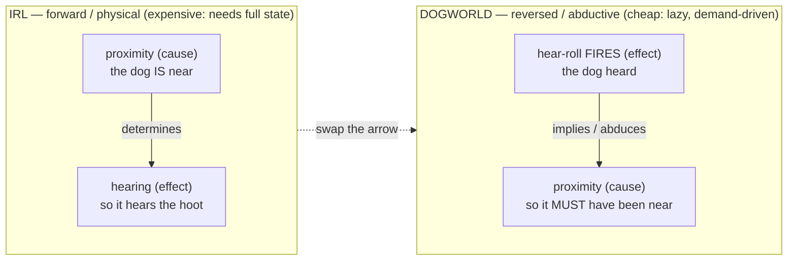
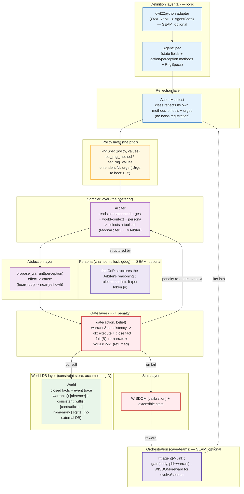
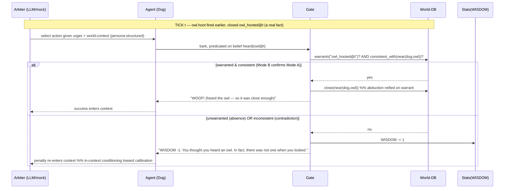
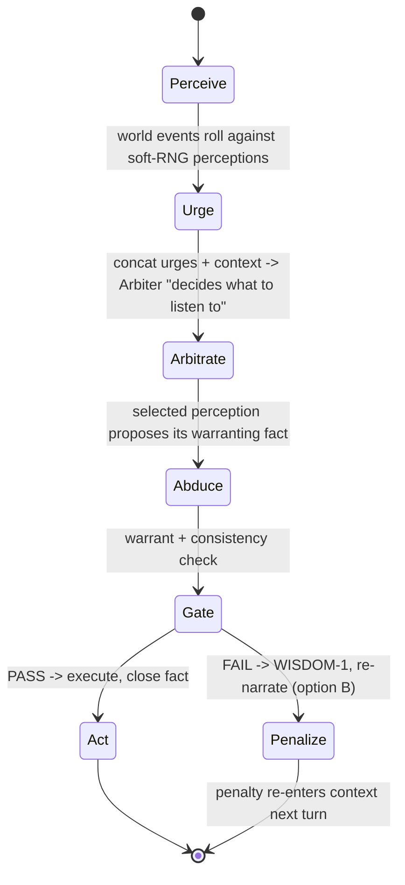
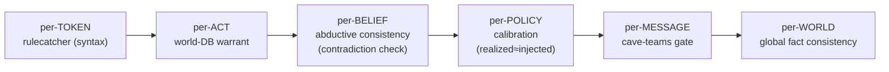
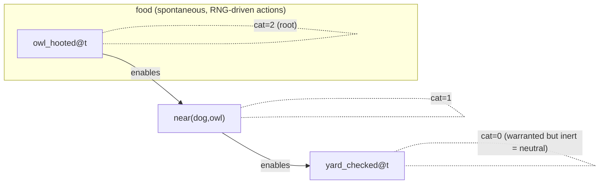

# Dogworld — DESIGN.md (canonical source of structural truth)

> **One line:** Dogworld is a multi-agent world engine where an agent's *belief* becomes a
> *world-fact* only if the world **warrants** it; acting on an unwarranted belief costs a
> calibration stat (**WISDOM**). The world is generated **backward** by abduction; soundness
> is a decidable **consistency gate**; the LLM is the **sampler/arbiter** over soft-RNG priors
> that inject as prompt-level urges.

This doc is the spec. Code is built to it (rule 26: one canonical design doc; `ASPIRATIONAL:`
marks anything not yet implemented). Provenance: crystallized from a design
dialogue (Dogworld / "P everywhere" / the owl-hoot→dog-bark causation swap / WISDOM −1).

---

## 0. The thesis (why this engine exists)

**Research-program framing (part of SSRI).** Dogworld is a testbed in the SSRI program, whose
central thesis is that **a Provider (an LLM) + a sound, automated Challenger (a symbolic gate)
produces validity/grounding/calibration the Provider cannot produce alone.** Each Dogworld
mechanism is an *operationalization* of that thesis (operationalize-or-it's-philosophy): the gate
is the automated Challenger; WISDOM/catalysis/calibration are the measurements. The program's
deeper gate machinery is developed elsewhere; this repo is the runnable, measurable core.

An LLM is a pure conditional sampler: it can emit "P" (a token, a belief, an action) without
"P-ness" (the property actually holding) — that's slop. You **cannot prevent** that from
inside the sampler; you need a **sound external gate**. Dogworld is that gate, made into a
*world*: the gate's verdict is returned as an in-world consequence (a stat change + a
re-narration) that **re-enters the agent's context** and conditions its next sample.

Two registers of the same fact, both implemented here:
- **Mode A (open-world / belief = existence):** "the dog heard an owl" because it sampled so.
- **Mode B (existence requires self-simulation / checking):** "...in fact there was not one
  when you looked." The world-DB is what "looking" consults.
- **WISDOM = the measured gap between Mode A and Mode B.** The gate skinned as XP.

---

## 1. The causation swap (the core mechanism)

Real life runs cause→effect. Dogworld runs the arrow **backward** (abduction = inference to
the best explanation), which is what makes the world cheap to generate:



Consequence: **you never specify the world.** You specify *interaction-probabilities*; a
fired perception **writes the minimal fact that would justify it** (`near(dog,owl)` is reified
on warrant). Relations self-assemble from perception events. BUT abduction can confabulate,
so every abduced fact must pass the **consistency gate** before it closes.

---

## 2. The layer / component architecture (static structure)



---

## 3. The interaction cascade (activity / sequence)



---

## 4. An agent turn (state machine)



---

## 5. The bijection (general ↔ system ↔ code) — the most important diagram (rule 23)

| General (theory) | Dogworld (system) | Code |
|---|---|---|
| Abduction (effect → cause) | a fired perception abduces its warrant | `abduction.py: propose_warrant` |
| Active inference (obs → hidden cause) | soft-RNG urge → Arbiter selects → world-fact | `arbiter.py`, `world.py` |
| Generative-model prior | `RngSpec(values)` rendered as an urge | `rng.py: RngSpec` |
| Posterior sampler | the Arbiter (mock default / LLM optional) | `arbiter.py` |
| Open-world closure | `close()`-on-warrant (reify on warrant) | `world.py: World.close` |
| Soundness / consistency `⊨` | warrant (absence) + contradiction check | `gate.py`, `world.py: consistent_with` |
| Reward / calibration | WISDOM (Mode-A−Mode-B gap) | `stats.py: Stats` |
| Self-describing agent | class reflects methods → tools+urges | `agent.py: Agent.manifest` |
| The gate at every scale | token/act/belief/policy/message/world | `gate.py` + seams |

---

## 6. The gate at every scale (the J-invariant — same `⊨`, many grains)



---

## 6b. Good — reward/fitness as CATALYSIS (the calculable "good")

The gate gives "bad" (WISDOM −1 = the world refused your belief = decoherence). "Good" is its
non-mirror dual: a **warranted act that CATALYZES further warranted structure**. Two axes, both
world-conferred (never self-granted), so "good" inherits the gate's soundness:

| axis | stat | measures | degenerate alone |
|---|---|---|---|
| **calibration** | WISDOM | belief tracks the world (false-positive cost) | abstain-always (cowardice) |
| **productivity** | fitness (catalysis) | warranted acts that enable more warranted acts | — |

Abstain-always keeps WISDOM high but earns **zero fitness** (no catalysis), so the two axes
together select for *calibrated AND productive* — the cowardice optimum is broken by fitness.



Definitions (all in `catalysis.py`, computed from the real run — world-conferred):
- **`cat(f)`** = size of f's descendant set in the enablement DAG = the downstream warranted
  structure f made possible. Warranted-but-inert → 0 (neutral); cascade root → high (very good).
- **`fitness(agent)`** = Σ `cat(f)` over the facts the agent closed = its catalytic contribution.
- **emergence = a RAF** (Reflexively-Autocatalytic, Food-generated set; `max_raf`, Hordijk–Steel
  closure): the food-grounded self-sustaining set of reactions. It **collapses without food** (no
  owl → no emergence). When a RAF appears, "good" stops being a per-act event and becomes a
  standing organism. `evolve`/`season` would select on fitness/RAF-centrality.

Grades: two-error calibration ↔ signal-detection theory = **G2**; fitness-as-catalysis ↔
autocatalytic-set theory (Kauffman RAF / Eigen) = **G5** (faithful, promotable by building it —
done: the owl→dog→master chain forms a RAF and collapses when starved); "good = emergence = life
= negentropy" = **G6** (dissipative-structures resonance, not a derivation).

## 6c. Places & the world chart — the LIVE heaven-agent overlay (✅ BUILT)

Dirs are **places**. Agents **move** between them; **proximity gates the warrant**; capability is
location-dependent.

- A place = a directory with a `place.md` listing **affordances** (what you can attempt here) and
  **exits** (where you can go = Read-breadcrumbs to neighbor dirs). `dogworld/places.py: PlaceWorld`
  loads the dir-tree into the chart.
- **capability(agent, now) = intrinsic tools (the manifest) ∪ place affordances ∪ co-located
  agents' shared skills.** Tools = what you *are*; place skills = what the *place* offers; shares =
  what *being near another agent* lends (the owl lends `see` to whoever is in the forest).
- **Proximity gates the warrant.** A belief's warrant can only exist where its cause is. The owl
  hoots in `forest`; the dog's `bark` requires `owl_hooted_at({place})@{t}` — so barking in the
  `yard` (no owl) is **unwarranted → WISDOM−1**, while barking in the `forest` is warranted. A live
  agent must **navigate to where its belief can be true.**
- **The mechanism.** On heaven, an agent Read()-ing into a place dir autoloads its `.claude`
  loadout natively. On the host we replicate it: the engine reads the place chart and injects it
  into the live LLM call (same semantics, host-runnable, no heaven needed).
- **Regularization tie (§ above):** a raw place is a *hyperstructure* (a loose bundle of "what's
  here"); `place.md` + the chart **regularize** it into the typed affordances/exits the gate runs
  over.

```
world/                         dog (live MiniMax) reads its chart each tick → bark | sniff | move
  forest/place.md  (owl here)  bark in forest where owl hooted → WOOF + near() + catalysis
  yard/place.md    (no owl)    bark in yard → WISDOM −1 (navigate away to be valid)
```

**Verified LIVE** (`examples/live_places.py`, real MiniMax): the dog reasoned *"No owl here,
barking would cost wisdom. Forest is where owls roost,"* **moved itself to the forest**, then
barked validly — WISDOM held at 10, `near(dog,owl)` closed. The offline core is unchanged (the
place-world is the LLM-agent overlay; `MockArbiter` tests stay stdlib).

**Proximity skill-sharing — also VERIFIED LIVE** (`examples/live_skillshare.py`): the owl lends
`see` to whoever is in the forest; the dog can't bark validly without first *confirming* an owl,
and it can only confirm by **borrowing the owl's sight**. The live MiniMax dog discovered the
three-step plan on its own — *move to forest → use the owl's lent `see` to confirm → then bark*
(WISDOM held at 10, `confirmed_owl(forest)` + `near(dog,owl)` closed). The borrowed skill is
load-bearing: without proximity to the owl, the dog cannot act validly. (Note: M2.7 is a thinking
model — give the live call enough `max_tokens` to think AND emit, or the JSON never lands.)

ASPIRATIONAL: native heaven `.claude` autoload traversal; graph (not tree) place topology; agent
populations that `evolve` over navigation policies.

## 6e. Learning — warranted routes → replayable SOPs (gated extrusion)

The SOP-extrusion pattern: bracket an event flow, extrude a parameterized procedure (the start KV →
`input_signature`, the events → `steps`). Dogworld adds the soundness the gate provides:

- **gated extrusion** — a step crystallizes into a SOP **only if the gate warranted it**. The plain
  pattern records what agents *did*; dogworld records what the world *validated*. A learned SOP is a
  **warranted route**, not merely a frequent one (the dog's `move→see→bark` becomes a SOP; the yard
  bark it tried is slop and is dropped). This is "routes = memory, carved on warrant."
- **fitness-ranked** — routes carry their catalytic `fitness`; `SOPStore.search` ranks by hits then fitness.
- **sound replay** — `replay()` re-checks every step's warrant against the current world; a stale
  SOP (the world changed) is rejected at the first warrant that no longer holds. *You can't replay a lie.*

So learning closes the loop with the rest of the engine: the gate that adjudicates a single belief
also decides what can be *remembered as a procedure*, and the same gate re-validates it on reuse.
VERIFIED (`examples/sop_demo.py`, `tests/test_sop.py`): 4 recorded → 3 kept (slop dropped); replay ok
when warrants hold, stale at the exact step when the world changed. ASPIRATIONAL: auto-bracket flows
from a live run (no manual start/end); promote a hot SOP into a skilltree node (a reusable skill).

## 7. Module plan (what gets built)

| module | responsibility | status |
|---|---|---|
| `dogworld/world.py` | constraint store: `close`, `warrants`, `consistent_with` (mutex/negation), event trace, optional sqlite | BUILD |
| `dogworld/stats.py` | `Stats` (WISDOM + extensible), deltas, history | BUILD |
| `dogworld/rng.py` | `RngSpec` (policy+values), NL-urge renderer, soft-roll | BUILD |
| `dogworld/agent.py` | `Agent` base: reflect methods → `manifest` (tools+urges); `set_rng_method/values` | BUILD |
| `dogworld/abduction.py` | `propose_warrant`: perception → warranting fact (effect→cause) | BUILD |
| `dogworld/gate.py` | the `⊨`: warrant+consistency → act-or-penalize(B, WISDOM−1, re-narrate); records catalysis edges | BUILD |
| `dogworld/catalysis.py` | the calculable "good": `cat(f)`, `fitness(agent)`, `max_raf` (emergence detection) | ✅ BUILT |
| `dogworld/sdt.py` | the informative-percept channel: `Channel`(d′), `Detector`(τ), `recovered_dprime`, `optimal_threshold` — makes calibration possible | ✅ BUILT |
| `dogworld/sop.py` | **learning**: `extrude` a flow → a SOP keeping ONLY warranted steps · `SOPStore` (search) · `replay` re-validates each step's warrant (stale routes rejected) | ✅ BUILT |
| `dogworld/places.py` | the world chart: `PlaceWorld` over a dir-tree (places, exits, move, proximity, capability, shares) | ✅ BUILT (live-verified) |
| `dogworld/arbiter.py` | `Arbiter` protocol; `MockArbiter` (deterministic/seeded); `LLMArbiter` (REAL — live MiniMax via `dogworld/llm.py`) | ✅ BUILT |
| `dogworld/llm.py` | the model transport: MiniMax via anthropic SDK + `MINIMAX_API_KEY` (bare path; host-runnable) | ✅ BUILT |
| `dogworld/seams/cave_runtime.py` | **Dogworld running ON cave-teams**: `gate(DecisionLink, WarrantGate)` — LLM decision = body, world-warrant+WISDOM = φ | ✅ BUILT + LIVE-VERIFIED |
| `examples/live_owl_dog_cave.py` | live MiniMax arbiter over cave's gate — the full loop incl. in-context conditioning | ✅ BUILT + LIVE-VERIFIED |
| `dogworld/engine.py` | the tick loop: perceive→urge→arbitrate→abduce→gate→act/penalize; calibration meter | BUILD |
| `dogworld/seams/owl22python_adapter.py` | OWL2/XML → `AgentSpec` (import owl22python if present; else minimal local parse) | ✅ BUILT |
| `dogworld/seams/cave_bridge.py` | `lift(agent)`→Link, `phi`=warrant, WISDOM=reward (import cave-teams if present) | 🟡 `make_phi` BUILT; `lift` ASPIRATIONAL (needs cave-teams installed) |
| `dogworld/seams/bigdog_persona.py` | load the bigdog CoR as Arbiter system-prompt; rulecatcher lint hook | ✅ BUILT + VERIFIED (prompt-engineering skill end-to-end) |
| `examples/owl_dog.py` | the owl/dog world wired end-to-end | ✅ BUILT |
| `examples/calibration_bench.py` | set `P(hoot)=0.7` → measure realized vs injected | ✅ BUILT |
| `tests/` | world, gate (absence+contradiction), rng, agent-reflection, engine cascade, calibration | ✅ BUILT — 17/17 pass |

### STATUS (built 2026-06-28; then LLM+cave wired live)
All core modules + examples + seams + tests BUILT and VERIFIED. `python3 tests/run_all.py` → **36 passed, 0 failed** (offline, no API, no external DB). **Live place-world (§6c) BUILT + VERIFIED LIVE** — a real MiniMax dog navigated dir-places (forest/yard) to where its bark is warranted; it reasoned about WISDOM, moved to the forest, barked validly (WISDOM held at 10). **Signal-detection calibration (`sdt.py`) BUILT** — interior optimum matches SDT theory, `d′` recovered, blind percept proven uncalibratable. **Catalysis/emergence (§6b) BUILT** (`catalysis.py` + `examples/catalysis_demo.py`): the owl→dog→master chain forms a RAF (fitness owl=2 > dog=1 > master=0, the owl is the catalytic root) and the RAF collapses when starved of food. Offline cascade/bench: WISDOM 10→7, bark calibration 0.70; realized hoot-freq tracks injected P; WISDOM-loss falls as the world gets owl-richer.

**LIVE (real LLM + cave-teams), `examples/live_owl_dog_cave.py` (set MINIMAX_API_KEY first):** a real **MiniMax** arbiter, orchestrated by **cave-teams' `gate(DecisionLink, WarrantGate)`** (the LLM decision is the `body` Link; the world-warrant + WISDOM check is the `φ` Link). Verified run:
```
[t1] owl HOOTS     | dog -> WOOF      | near(dog,owl) abduced & closed
[t2] owl is silent | dog -> penalty   | WISDOM -1: You thought you heard an owl. In fact, there was not one when you looked.
[t3-5] owl silent  | dog -> abstained | (LEARNED from the t2 penalty fed back into context — in-context conditioning)
```
The prompt-engineering seam is verified end-to-end (builds the BIGDOG CoR persona; rulecatcher gate lints, 29 rules) — used for the gate/persona, NOT as the arbiter's prose-demanding system prompt (that conflicts with the JSON tool-selection contract; the bigdog gate lints reasoning separately).

Remaining ASPIRATIONAL: OWL ObjectProperties→methods (verbs from logic), the **semantic half of the gate** (judging meaning — the program's frontier), multi-agent cave topologies beyond the single gate (evolve/season on **fitness/catalysis**), packaging `owl22python` as an importable dependency.

**The informative-percept channel — ✅ BUILT (`sdt.py` + `examples/sdt_evolve.py`).** Blind
soft-RNG firing cannot be *calibrated* (a perception that fires independently of ground truth has
no interior optimum). So the world now emits a **noisy percept** correlated with truth
(equal-variance Gaussian SDT: `signal|owl ~ N(d′,1)`, `signal|¬owl ~ N(0,1)`); the agent barks iff
the signal exceeds its threshold `τ`. Every bark is adjudicated by the REAL gate, so the reward is
`net(τ) = fitness(catalysis from hits) − WISDOM_loss(false alarms) − miss_cost·misses`. **Verified
result:** with `d′=2` there is a clean **interior optimum** (`τ*≈+0.75`) that **matches the
SDT-optimal criterion** (`+0.65`), and the channel's `d′` is **recovered** (`z(HR)−z(FAR)=2.03`).
With `d′=0` the optimum vanishes (HR≈FAR at every τ) — *a blind agent cannot be calibrated*, the
finding confirmed. This unifies the two axes: WISDOM (calibration via τ) × catalysis (productivity
via the gate) selected in one landscape. ASPIRATIONAL remainder: drive a population `evolve` over
`τ` on cave-teams `season`; let the `LLMArbiter` (which reasons over the percept) be the policy in
place of a fixed threshold.

### Design note — sampler vs. live LLM
The default sampler is `MockArbiter` (deterministic, offline) so the engine is fully testable without a model. `LLMArbiter` wires a live **MiniMax** arbiter, and `cave_runtime.py` runs Dogworld ON cave-teams' `gate` (the LLM decision is `body`, the world-warrant check is `φ`). The host live path needs only `MINIMAX_API_KEY` in env + the anthropic SDK + the bare endpoint.

## 8. Constraints (hard)
- **No external database.** World-DB = in-memory or local sqlite only.
- **No live API calls by default.** `MockArbiter` is the default sampler; `LLMArbiter` exists but is never auto-invoked in tests/examples.
- **Stdlib only** for the core (no new pip installs). Seams import companion packages *if present* (try/except), never reimplement them (reuse rule).
- **Only write inside the repo.**

## 9. Soundness note (honest grade)
The gate is **prevention-grade (sound) on the decidable fragment**: `warrants` = exact set
membership; `consistent_with` = declared mutex/negation pairs. It does NOT judge semantic
correctness (whether "hunt" means hunting) — that's the documented frontier (the semantic half of the gate). Calibration is **measured**, not asserted. Correspondences to active-inference/abduction
are **G2** (same machine); "self-simulating qua its own world" is **G6** (right shape, the apex
direction, not claimed as achieved).
